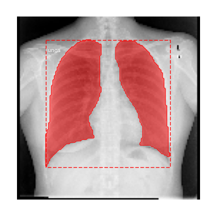
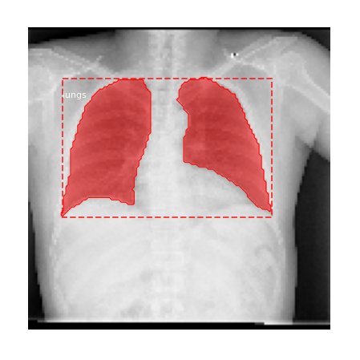
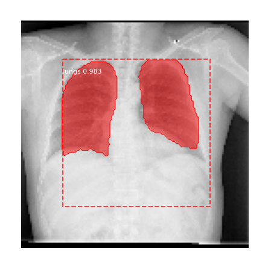
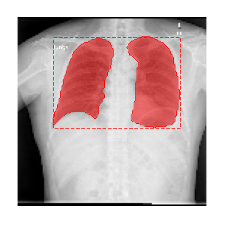
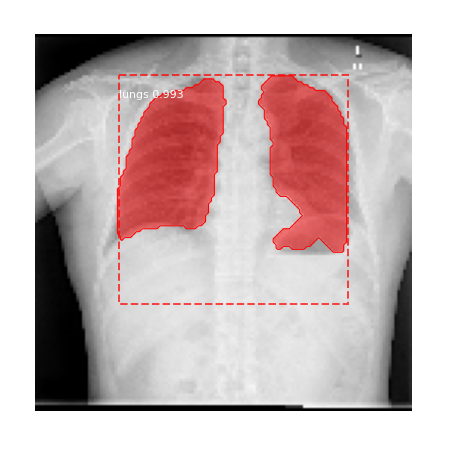

# Mask R-CNN for Lungs detection and segmentation
This is an implementation of [Mask R-CNN](https://arxiv.org/abs/1703.06870) on Python 3, Keras, and TensorFlow.

The lungs datasets used in this notebook is availiable at
* [lungs X-Rays](https://www.kaggle.com/kmader/pulmonary-chest-xray-abnormalities)
* [lungs X-Rays masks](https://www.kaggle.com/yoctoman/shcxr-lung-mask)
* [pre-trained weights](https://github.com/matterport/Mask_RCNN/releases)

Special kudos for [base implementation](https://github.com/matterport/Mask_RCNN).

In this notebook, I used pre-trained MS COCO weights for Lungs detection and segmentation.

## Notebook
* ([model.py](mrcnn/model.py), [utils.py](mrcnn/utils.py), [config.py](mrcnn/config.py)): These files contain the main Mask RCNN implementation. 
* [01_train_lungs.ipynb](01_train_lungs.ipynb) : this notebook with training implementation

## Approach
The data consist of 567 masks and 663 X-rays. Here I used only the X-rays that have masks. The data was split into a 10:1 ratio for learning. That resulted in 510 train images and 57 validation images. 
The learning consist of two phases:
1. Take the pre-trained MS COCO weights and freeze all backbone layers and train only randomly initialized layers with a learning rate equal to 0.001 and one epoch. 
2. Fine-tune all layers using 0.0001 learning rate and two epochs.

It takes roughly 1 hour to run the whole notebook, to increase the accuracy of masks number of steps per epoch could be increased. It is also worth noting that images were scaled down to 128x128 resolution for faster training. This results in lower resolution results. Resolution can be increased for better results, but it'll impact learning speed.

## Results
Results | Original             |  Prediction
:-------------------------:|:-------------------------:|:-------------------------:
1 |  | 
2 |  | 
3 |  | 

## To run the notebook
* Install dependencies
   ```bash
   pip3 install -r requirements.txt
   ```
* Download [lungs X-Rays](https://www.kaggle.com/kmader/pulmonary-chest-xray-abnormalities) and unpack zip to data directory
* [lungs X-Rays masks](https://www.kaggle.com/yoctoman/shcxr-lung-mask)  and unpack zip to data directory
* Download pre-trained COCO weights (mask_rcnn_coco.h5) from the [releases page](https://github.com/matterport/Mask_RCNN/releases) and put in data directory.
* Install pycocotools [Windows](https://github.com/philferriere/cocoapi) or [Linux](https://github.com/waleedka/coco)
* Have cup of your favourite cofee